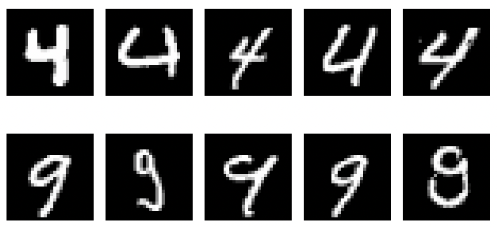
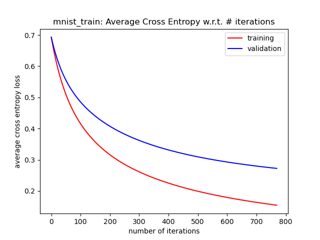

# Compare k-nn and Logistic Regression

## Goal

Compare the performance and characteristics of k-Nearest Neighbors and Logistic Regression.

## Dataset

The data we used is a subset of MNIST hand-written digits, 4s and 9s, repre-sented as 28 × 28 pixel arrays.(see the figure below). There are two training sets: `mnist_train`, which contains 80 examples of each class, and `mnist_train_small`, which contains 5 examples of each class. There is also a validation set `mnist_valid` used for model selection, and a test set `mnist_test` used for reporting the final performance.

## Cross Entropy Change

